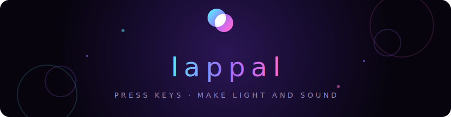

<div align="center">



**An interactive audiovisual keyboard inspired by [patatap.com](https://patatap.com).**

Press a key — a neon animation blooms across the screen with a matching sound.
Every combination harmonizes. Every press looks a little different.


</div>

## ✨ What it does

- **12 keys, 12 distinct visuals** — rings, bursts, polygons, rays, spirals, comets and more, glowing additively over a deep-purple canvas with soft motion trails
- **Impossible to play a wrong note** — the melodic keys are mapped to C&#9839; minor pentatonic, so any mash of keys harmonizes
- **Percussion row** — kick, hat, and tom round out the kit, all running through a shared reverb + delay bus
- **Click anywhere** — pressing the canvas fires a random pad right where you clicked
- **Key strip** — a glowing key map along the bottom lights up with every press, and is clickable too
- **Works on phones** — touch devices get a tappable pad grid instead of the keyboard
- **Never a dead screen** — a faint field of drifting, twinkling particles keeps the canvas alive between presses

## 🎹 Controls

Click or press any key to start the audio, then play:

| Key | Sound | Visual |
| :-: | --- | --- |
| `A` | C&#9839;3 | expanding rings |
| `S` | E3 | particle burst |
| `D` | F&#9839;3 | rotating polygons |
| `F` | G&#9839;3 | popping circle |
| `G` | B3 | radiating rays |
| `H` | C&#9839;4 | soft bloom |
| `J` | E4 | unwinding spiral |
| `K` | G&#9839;4 | water ripple |
| `L` | B4 | scattering shards |
| `Q` | kick | orbiting dots |
| `W` | hat | comet |
| `E` | tom | flower petals |

…or click/tap the canvas for a surprise at your cursor.

## 🚀 Quick start

```sh
npm install
npm run dev        # dev server at http://localhost:5173
npm run build      # type-check + production build to dist/
npm run preview    # serve the production build locally
```

## 🛠 How it works

Everything about a pad — key, label, color, shape, sound — is one line in
[`src/config/soundMap.ts`](src/config/soundMap.ts); the keyboard handler, key strip,
mobile pads, visuals, and audio all derive from it. Visuals run through a single
p5.js instance ([`src/visuals/visualEngine.ts`](src/visuals/visualEngine.ts)) whose
draw loop paints a translucent background wash for motion trails, then renders every
animation in additive blend mode so overlapping shapes literally sum into brighter
light. Audio is a lazy Tone.js graph ([`src/audio/soundEngine.ts`](src/audio/soundEngine.ts)):
a polyphonic synth plus kick/hat/tom, all feeding delay → reverb → limiter.

**Adding a key** is a one-line edit to `PADS` in `soundMap.ts`. A new shape is one
small class in [`src/visuals/shapes/`](src/visuals/shapes/) plus a case in its factory.

## ☁️ Deploying to Vercel (free)

The app is a static Vite SPA — Vercel auto-detects everything, no config needed.

1. Push the repo to GitHub.
2. Go to [vercel.com](https://vercel.com), sign in with GitHub, **Add New… → Project**.
3. Import the `lappal` repo — the framework is auto-detected as Vite.
4. **Deploy**. The site goes live at `lappal-*.vercel.app` and redeploys on every push to `main`.

<details>
<summary>Prefer the CLI?</summary>

```sh
npm i -g vercel
vercel          # accept the defaults
vercel --prod
```

</details>

## 🎨 Branding

The full logo set lives in [`branding/`](branding/): icon mark, dark & light lockups,
wordmark, and the README banner — all hand-built SVG in the app's palette.

| | |
| --- | --- |
|  |  |

## 📄 License

Copyright &copy; 2026 SC7RED. Licensed under the
[PolyForm Strict License 1.0.0](LICENSE.md) — you may view and run this code
privately for noncommercial purposes only; no modification, redistribution,
or commercial use without written permission.
